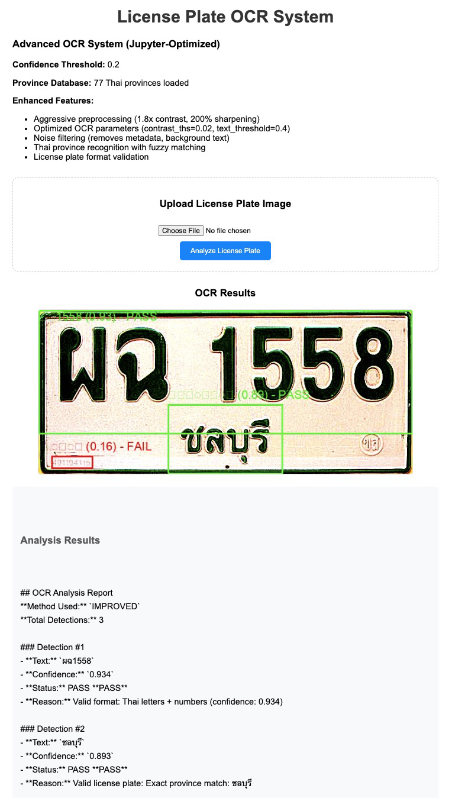

# License Plate OCR Lab

This project implements a complete license plate OCR system using EasyOCR for Thai license plates.

## Features

- **EasyOCR Integration**: Uses EasyOCR with Thai character support
- **Image Preprocessing**: Contrast enhancement and unsharp masking for better OCR accuracy
- **Confidence Filtering**: Configurable confidence threshold to filter low-quality detections

- **Visualization**: Draws bounding boxes with Pass/Fail status on detected text
- **Web Interface**: Flask-based web application for easy testing
- **Jupyter Notebook**: Complete experimental notebook with parameter tuning

## Setup

1. **Create and activate virtual environment:**
   ```bash
   python3 -m venv --system-site-packages env-license-plate-ocr
   source env-license-plate-ocr/bin/activate
   ```

2. **Install dependencies:**
   ```bash
   pip install torch torchvision torchaudio --index-url https://download.pytorch.org/whl/cpu
   pip install flask gdown easyocr pillow numpy --no-cache-dir
   ```

3. **Download sample images:**
   ```bash
   gdown 1rGHs_bV7CH34lzvvFgCW6LNNKTGjxufj -O license-plate-th.jpg
   gdown 1sZ0h6eRmFaYFKX9SXGuMBKV_0Xrhehf6 -O license-plate-th2.jpg
   gdown 1o-EobL07p_EU7PCo0100AJ_cLR_2mJDH -O license-plate-th3.jpg
   ```

## Usage

### Jupyter Notebook (Recommended for Experiments)

1. **Start Jupyter:**
   ```bash
   source env-license-plate-ocr/bin/activate
   jupyter notebook license_plate_ocr_lab.ipynb
   ```

2. **Run all cells** to see:
   - Basic OCR implementation
   - Parameter tuning experiments
   - Image preprocessing comparison
   - Confidence threshold testing
   - Complete pipeline with visualization

### Flask Web Application

1. **Start the web server:**
   ```bash
   source env-license-plate-ocr/bin/activate
   python flask_app.py
   ```

2. **Access the application** at: http://localhost:5000

3. **Upload license plate images** and see real-time OCR results with Pass/Fail validation
